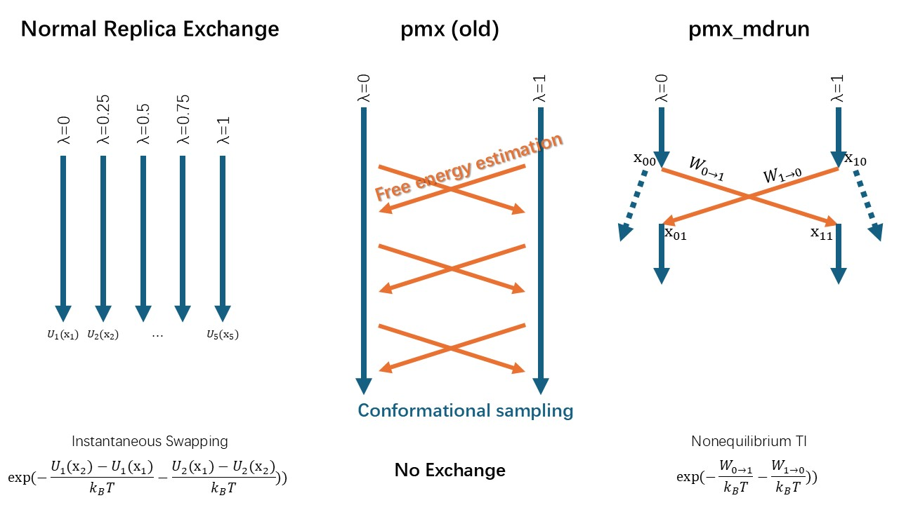

# pmx_NCMC
Add replica exchange [(ref1)](#4-reference) to pmx free energy calculation. The more general form of
replica exchange is nonequilibrium candidate Monte Carlo (NCMC) [(ref2)](#4-reference). This python 
package is an IO based implementation of replica exchange for pmx-style free 
energy calculation.

## 1. Installation
### 1.1 Create a conda/mamba env
```bash
mamba create -n pmx_NCMC python=3.11 pymbar numpy pandas matplotlib -c conda-forge
mamba activate  pmx_NCMC  # mambda works the same as conda
```
### 1.2 Pip install package
```
git clone https://github.com/huichenggong/pmx_NCMC.git
pip install .
```
### 1.X Remove environment
```bash
mamba remove -n pmx_NCMC --all
```


## 2. Example
Working on it.

## 3. Theory


## 4. Reference
(1)	Ballard, A. J.; Jarzynski, C. Replica Exchange with Nonequilibrium Switches. Proc. Natl. Acad. Sci. 2009, 106 (30), 12224–12229. https://doi.org/10.1073/pnas.0900406106.  
(2)	Nilmeier, J. P.; Crooks, G. E.; Minh, D. D. L.; Chodera, J. D. Nonequilibrium Candidate Monte Carlo Is an Efficient Tool for Equilibrium Simulation. Proc. Natl. Acad. Sci. 2011, 108 (45). https://doi.org/10.1073/pnas.1106094108.  
