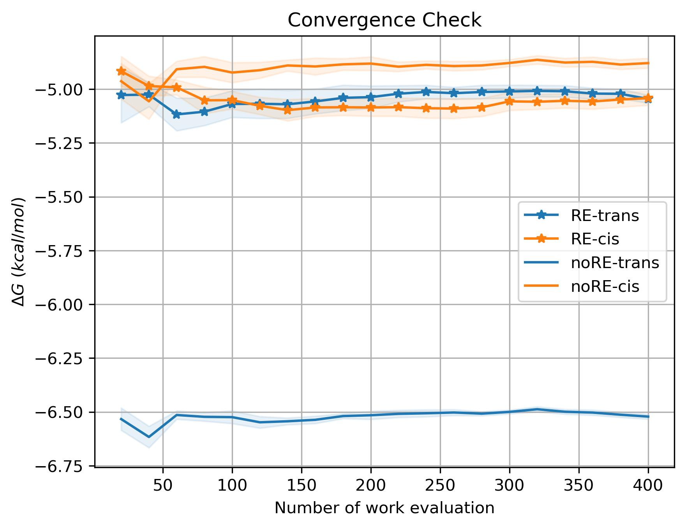

# pmx_NCMC
Add replica exchange [(ref1)](#4-reference) to pmx free energy calculation. The more general form of
replica exchange is nonequilibrium candidate Monte Carlo (NCMC) [(ref2)](#4-reference). This python 
package is an IO based implementation of replica exchange for pmx-style free 
energy calculation.

## 1. Installation
### 1.1 Create a conda/mamba env
```bash
mamba create -n pmx_NCMC python=3.11 pymbar numpy pandas matplotlib -c conda-forge
mamba activate  pmx_NCMC  # mambda works the same as conda
```
### 1.2 Pip install package
```
git clone https://github.com/huichenggong/pmx_NCMC.git
pip install .
```
### 1.X Remove environment
```bash
mamba remove -n pmx_NCMC --all
```


## 2. Example
```bash
cd test/2-pentene/
```
In stateA, it's a normal pentene. In stateB, the dihedral potential around 
the double bond is removed. We can either start from trans or cis.
```bash
mdrun/01-trans/em.gro
mdrun/02-cis/em.gro
```
Eventrually, the free energy difference between stateA and stateB should be the same, 
regardless of the starting conformation. 
```bash
cd mdrun/01-trans/
./run_10-1-prepare.sh # prepare 10 replicas
./run_10-2-submit.sh  # submit 10 replicas to the cluster
```
In case you don't want to submit them to the cluster. You can also test it like this.  
```bash
# prepare 1 replica with 50ps of eq
cd mdrun/01-trans/rep_999
base=$PWD
for i in 0 1 # 0 and 1 correspond to stateA and stateB
do
    cd $base/eq/$i
    gmx grompp -f eq.mdp -c ../../../em.gro -p ../../../../../topol.top  -o eq
done
cd $base
mpirun -np 2 --bind-to none gmx_mpi mdrun -v -s eq.tpr -deffnm eq -multidir eq/? 
```
Before you start a pmx_mdrun, you need to prepare the mdp files and the tpr file for the first eq. They are :  
```bash
├── 000000
│   ├── 0
│   │   └── eq.tpr
│   └── 1
│       └── eq.tpr
└── mdp
    ├── eq0.mdp # eq run for stateA
    ├── eq1.mdp # eq run for stateB
    ├── ti0.mdp # ti run for A to B
    └── ti1.mdp # ti run for B to A
# eq+ti would be 1 cycle
```
You can prepare 2 tpr files by:
```bash
base=$PWD
cd $base
mkdir 000000
cd 000000
mkdir 0 1
cd $base/000000/0
gmx grompp -f ../../mdp/eq0.mdp -c ../../eq/0/eq.gro -p ../../../../../topol.top -o eq
cd $base/000000/1
gmx grompp -f ../../mdp/eq1.mdp -c ../../eq/1/eq.gro -p ../../../../../topol.top -o eq
cd $base
```
You can use the following command to start and append a pmx_mdrun.
```bash
./run_1_eq.sh # prepare this replica
pmx_mdrun -h
pmx_mdrun \
    -l md_0.log \
    -mdp_folder mdp/ -p ../../../topol.top -folder_start 000000 \
    -cycle 10 \
    -MDRUN "mpirun -np 2 --bind-to none gmx_mpi mdrun" \
    -GROMPP "gmx grompp" \
    --format "%(message)s" \
    -maxh 5 # 10 is too little. You probably need 200 cycles to converge the delta G
pmx_mdrun \
    -l md_0.log \
    -mdp_folder mdp/ -p ../../../topol.top -folder_start 000009 \
    -cycle 10 \
    -MDRUN "mpirun -np 2 --bind-to none gmx_mpi mdrun" \
    -GROMPP "gmx grompp" \
    --format "%(message)s" \
    -maxh 5 # Append 10 more cycles from 000009
```
Use BAR (bennett acceptance ratio) to estimate the free energy difference.
```bash
analysis_bar -csv md.csv -oA integA.dat -oB integB.dat --unit kcal
# save work to integA.dat and integB.dat for pmx analyse
# TODO: time correlation and sub-sampling
```
Trans and cis converge to the same value as expected.  



## 3. Theory


## 4. Reference
(1)	Ballard, A. J.; Jarzynski, C. Replica Exchange with Nonequilibrium Switches. Proc. Natl. Acad. Sci. 2009, 106 (30), 12224–12229. https://doi.org/10.1073/pnas.0900406106.  
(2)	Nilmeier, J. P.; Crooks, G. E.; Minh, D. D. L.; Chodera, J. D. Nonequilibrium Candidate Monte Carlo Is an Efficient Tool for Equilibrium Simulation. Proc. Natl. Acad. Sci. 2011, 108 (45). https://doi.org/10.1073/pnas.1106094108.  
