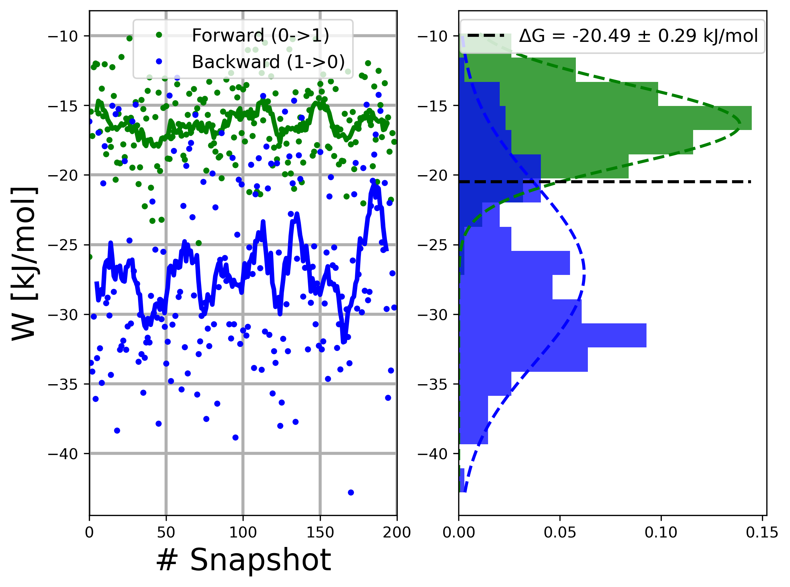
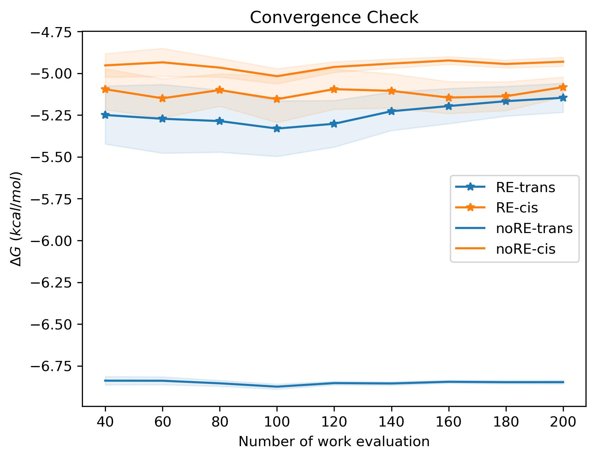

# 2-pentene  
This is a test case for `pmx_mdrun`. In this test case. State A is a 2-pentene, and state B 
has all the dihedral potential removed around the double bond.

## 1. Topology  
Preparation of the top is documented in `00-TOP/README.md`. It's a 2-pentene in gaff prepared by antechamber and acpype.  

## 2. mdrun  
We can start the simulation from either trans or cis.
```bash
mdrun/01-trans/
mdrun/02-cis/
```
### 2.1 Trans starts (with given bash script)  
```bash
cd mdrun/01-trans/
tree -L 1
├── em.gro
├── rep_999
├── run_10-1-prepare.sh
└── run_10-2-submit.sh
```
`em.gro` has the double bond in trans
`rep_999` is 1 template folder for one replica
`run_10-1-prepare.sh` copy the template to `rep_0`, `rep_1`, ... , and run a initial equlibriation.
`run_10-2-submit.sh` submit all replicas to the cluster with given slurm template.

### 2.2 Cis starts  
```bash
cd mdrun/02-cis/
cp ../01-trans/rep_999 ./ -r
```

### 2.3 run pmx_mdrun (step by step)  
1. Prepare 1 replica
```bash
cd mdrun/01-trans/
cp rep_999 rep_0 -r
```
  
2. Pre-equilibrium  
```bash
base=$PWD

for i in 0 1 
do
    cd $base/eq/$i
    gmx grompp -f eq.mdp -c ../../../em.gro -p ../../../../../topol.top  -o eq
    gmx mdrun -v -deffnm eq
done

mkdir 000000
cd 000000
mkdir 0 1
cd $base/000000/0
gmx grompp -f ../../mdp/eq0.mdp -c ../../eq/0/eq.gro -p ../../../../../topol.top -o eq
cd $base/000000/1
gmx grompp -f ../../mdp/eq1.mdp -c ../../eq/1/eq.gro -p ../../../../../topol.top -o eq

cd $base
```

3. Now we has everything for `pmx_mdrun`  
```bash
├── 000000         # cycle 0, 1 eq + 1 ti would be 1 cycle
│   ├── 0
│   │   └── eq.tpr # 100 ps equilibrium MD in state A
│   └── 1
│       └── eq.tpr # 100 ps equilibrium MD in state B
└── mdp
    ├── eq0.mdp    # eq run for stateA
    ├── eq1.mdp    # eq run for stateB
    ├── ti0.mdp    # ti run for A to B
    └── ti1.mdp    # ti run for B to A
```

4. Start a new mdrun  
```bash
pmx_mdrun \
    -l md_0.log \
    -mdp_folder mdp/ -p ../../../topol.top -folder_start 000000 \
    -cycle 10 \
    -MDRUN "mpirun -np 2 --bind-to none gmx_mpi mdrun" \
    -GROMPP "gmx grompp"
```

5. Append more cycle  
Output files `md_0.log` and `md.csv` will be append.
```bash
pmx_mdrun \
    -l md_0.log \
    -mdp_folder mdp/ -p ../../../topol.top -folder_start 000009 \
    -cycle 10 \
    -MDRUN "mpirun -np 2 --bind-to none gmx_mpi mdrun" \
    -GROMPP "gmx grompp"
```
If the job finished properly, at the end of the log file, free energy estimated by bar will be printed.
```
Read md.csv and estimate free energy difference using 200 cycles.
DeltaG = -20.31 +- 0.30 kJ/mol
       =  -4.85 +- 0.07 kcal/mol
```

6. Free energy estimation  
```bash
analysis_bar -csv md.csv --unit kcal
```
The work distribution will be plotted in `Wplot.png`


You can also save the work value in separate files, if you want to adapt to pmx work flow.  
```bash
analysis_bar -csv md.csv -oA integA.dat -oB integB.dat --unit kcal
# unit argument will not change output unit in integA.dat and integB.dat, as pmx only accept kJ/mol
pmx analyse -iA integA.dat -iB integB.dat
```

## 3. Further analysis  

Without replica exchange, trans and cis would not converge to the same value.  
The detail analysis can be found in `mdrun/convergence.ipynb`
